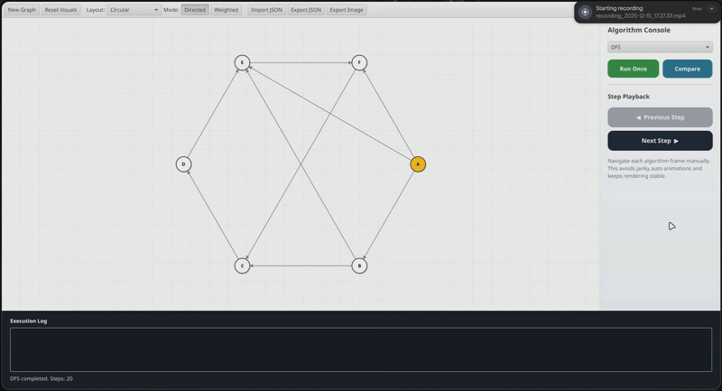
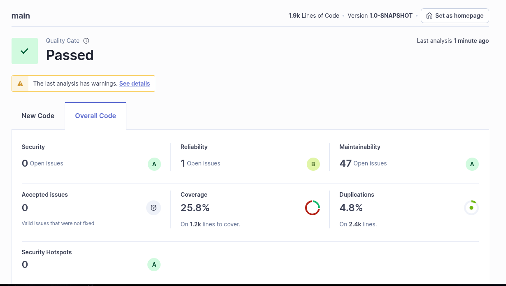

# GraphVizFX

## Project Report

---

## 1. Project Overview

**GraphVizFX** is a desktop-based graph visualization and algorithm exploration platform developed in **Java** using **JavaFX**. The project is conceived as a **complete, polished, and extensible educational tool**, designed to go beyond basic algorithm demonstrations and offer a genuinely insightful exploration of graph theory.

At its core, GraphVizFX transforms abstract algorithmic concepts into **clear, interactive, and visually traceable processes**. Instead of treating algorithms as black boxes that output results, the application exposes their internal behavior, step by step, on user-defined graphs.

This makes GraphVizFX particularly compelling as a project because it combines:

* algorithmic correctness,
* thoughtful software architecture,
* interactive visualization,
* and quality-oriented development practices.

From an academic standpoint, it demonstrates not only knowledge of graph algorithms, but also the ability to **design a system that explains them**.


---

## 2. Objectives and Educational Value

The main objectives of GraphVizFX are:

* To provide a **visual and interactive representation** of graph structures and algorithms.
* To bridge the gap between **theoretical algorithm descriptions** and their **practical execution**.
* To offer a **safe experimentation environment** where users can modify graphs and instantly observe algorithmic behavior.
* To serve as a **foundation project** that can be extended with additional algorithms, layouts, or data sources.

From an academic and practical perspective, the project is valuable because it:

* reinforces algorithmic intuition,
* encourages modular software design,
* demonstrates real-world usage of JavaFX for non-trivial applications,
* integrates testing and quality considerations into an algorithm-heavy project.

---

## 3. Feature Set

GraphVizFX includes a comprehensive set of features that cover graph creation, manipulation, visualization, and analysis.

### 3.1 Graph Construction and Editing

* Creation of nodes and edges through an interactive interface
* Support for **directed and undirected graphs**
* Support for **weighted edges**
* Dynamic addition and removal of nodes and edges
* Automatic graph consistency maintenance after deletions


### 3.2 Graph Layouts and Visualization

* Multiple layout strategies (e.g., circular, grid-based, force-inspired layouts)
* Stable node positioning to preserve user mental models
* Clear visual distinction between nodes, edges, and weights
* Highlighting of active nodes and edges during algorithm execution
* Smooth animations for transitions and algorithm steps
* The ability to force directionality in undirected graphs for algorithm visualization purposes
* Resetting highlights and visual states after algorithm completion or manual reset


### 3.3 Algorithm Visualization

The application supports visualization of several classical graph algorithms, including:

* Breadth-First Search (BFS)
* Depth-First Search (DFS)
* Dijkstra’s shortest path algorithm
* A* search
* Minimum spanning tree algorithms (Prim, Kruskal)

For each algorithm:

* Execution is shown step by step
* Visited nodes and selected edges are visually highlighted
* Logs describe the internal decisions made by the algorithm
* Execution speed can be controlled by the user

A defining feature of GraphVizFX is that **algorithm visualization is deterministic and reproducible**. Given the same graph and starting conditions, the execution path remains consistent, making it suitable for rigorous comparison and learning.


### 3.4 Algorithm Comparison Feature

GraphVizFX includes an **algorithm comparison mode**, allowing users to execute and compare two algorithms on the **same graph** under identical conditions.

This feature enables:

* Direct comparison of traversal strategies (e.g., BFS vs DFS)
* Comparison of shortest-path algorithms (e.g., Dijkstra vs A*)
* Visual and textual contrast of visited nodes, selected edges, and execution paths

By presenting algorithms side by side, the application highlights **differences in strategy, efficiency, and behavior**, reinforcing theoretical insights through direct observation.


### 3.5 Import, Export, and Persistence

* Graphs can be exported to **JSON** format
* Previously saved graphs can be re-imported
* Export of graph visualizations as image files (PNG)

### 3.5 Logging and Observability

* Real-time logs describing algorithm progress
* Clear textual feedback synchronized with visual updates
* Logs designed to complement, not replace, visualization

### 3.6 Little demonstration
Here is a little demonstration of the application in action:


---

## 4. Technical Architecture

### 4.1 Technology Stack

* **Java 21**
* **JavaFX 21** for UI and visualization
* **Maven** for build and dependency management
* **JUnit 5 (Jupiter)** for unit testing

### 4.2 Project Structure

The codebase follows a modular and readable structure:

* `model` – core graph data structures (nodes, edges, graphs)
* `algorithms` – algorithm implementations independent of UI
* `layout` – node positioning and layout strategies
* `io` – JSON import/export logic
* `controller` – interaction logic connecting UI and core logic
* `view` – JavaFX components and visualization layers

This separation ensures that algorithmic logic remains testable and reusable, while UI-specific code is isolated.

---

## 5. Implementation Details

### 5.1 Core Logic

The core graph model is designed to be deterministic and robust:

* Nodes are uniquely identifiable and safely comparable
* Edges encapsulate direction and weight information
* Graph operations enforce internal consistency

Algorithms operate exclusively on these data structures, without direct dependency on JavaFX components. This design decision was intentional to:

* simplify testing,
* reduce coupling,
* allow future reuse of algorithms outside the UI context.

### 5.2 Algorithm Execution Flow

Each algorithm follows a structured execution model:

1. Validation of input graph and source node
2. Initialization of algorithm-specific data structures
3. Step-by-step execution with explicit state updates
4. Emission of visual and textual events

This approach enables both visualization and logging without duplicating logic.

### 5.3 Unit Testing

Unit tests were added under `src/test/java` using **JUnit 5**.

The tests focus on:

* Graph data structures (node and edge creation, addition, removal)
* Algorithm correctness on small, deterministic graphs
* Handling of edge cases (disconnected graphs, invalid sources)
* JSON import/export consistency

UI rendering, JavaFX stages, and animation timing are intentionally excluded from unit testing to avoid brittle tests and unnecessary complexity.

The test suite is designed to run with:

```
mvn test
```

and integrates cleanly with Maven and CI pipelines.

---

## 6. Challenges Encountered and Solutions

### 6.1 Integration of OpenStreetMap Data

**Problem:**
An early idea was to integrate OpenStreetMap (OSM) data to allow real-world map-based graph visualization. However, the available APIs produced incomplete and inconsistent data. Some streets were missing, others were poorly rendered, and the overall visualization lacked clarity.

**Analysis:**
The integration introduced significant complexity while providing limited educational value. Moreover, the visual noise reduced readability, which contradicted the project’s primary goal of clarity and algorithm understanding.

**Solution:**
The OSM integration was deliberately postponed. The feature was dropped in favor of maintaining a clean and controlled visualization environment. The project remains open to future integration with a more suitable and reliable mapping API.

---

### 6.2 JavaFX and Maven Compatibility Issues

**Problem:**
Initial builds failed due to a mismatch between the Java version installed on the system (Java 17) and the JavaFX and Maven configuration targeting Java 21.

**Analysis:**
JavaFX is particularly sensitive to version mismatches, and the issue manifested as runtime and plugin resolution errors in `pom.xml`.

**Solution:**
The issue was resolved by installing **Java 21** and explicitly configuring the correct SDK in the development environment. Maven and JavaFX dependencies were aligned with the target Java version, restoring build stability.

---

### 6.3 Logging Synchronization Issues

**Problem:**
During early algorithm executions, logs were not displayed consistently with visual updates, leading to confusion about algorithm progress.

**Analysis:**
The issue was traced back to improper synchronization between algorithm execution steps and log emission.

**Solution:**
The logging mechanism was restructured so that logs are emitted at well-defined execution points. This ensured that textual feedback accurately reflects the current algorithmic state.

---

## 7. Limitations

While GraphVizFX is functional and robust, certain limitations remain:

* No automated UI testing
* Limited number of layout algorithms
* No real-world map integration at this stage
* Performance optimizations for very large graphs are limited

These limitations are acknowledged and documented for future work.

---

## 8. Software Quality and SonarQube Analysis

### 2.1 Static Analysis (SonarQube)


| Metric | Result | Detail |
| --- | --- | --- |
| Quality Gate | Passed | Main branch, version 1.0-SNAPSHOT; ~1.9k LOC analyzed |
| Reliability | B | 1 open issue (indicates at least one non-trivial bug) |
| Maintainability | A | 47 open code smells |
| Coverage | 25.8% | 1.2k lines to cover; markedly below target and tied to previously noted Critical Weaknesses |
| Duplications | 4.8% | 2.4k lines analyzed, low duplication footprint |

The static analysis confirms the project passes the Quality Gate with strong Security (A, 0 issues/hotspots) and Maintainability (A). However, the Reliability grade of B signals a remaining defect that should be addressed prior to release. Most notably, coverage at 25.8% leaves a significant portion of logic unverified; this gap directly aligns with the Critical Weaknesses highlighted in the Executive Summary and should be prioritized to mitigate undiscovered regressions. Duplications remain acceptable at 4.8%.

---

## 9. Conclusion

GraphVizFX positions itself as more than a simple academic exercise. It is a **coherent, well-architected, and feature-rich platform** that successfully merges algorithmic theory with practical visualization.

The project distinguishes itself through:

* its emphasis on explanation rather than mere execution,
* its clean separation between logic and visualization,
* its support for direct algorithm comparison,
* and its integration of testing and quality-oriented development practices.

These characteristics make GraphVizFX particularly well-suited for academic demonstration, learning environments, and future research-oriented extensions.

With continued refinement, quality analysis via SonarQube, and the addition of new algorithms and comparison metrics, GraphVizFX has the potential to evolve into a reference tool for graph algorithm visualization.

In short, GraphVizFX is not just functional — it is **convincing, extensible, and academically valuable**.
